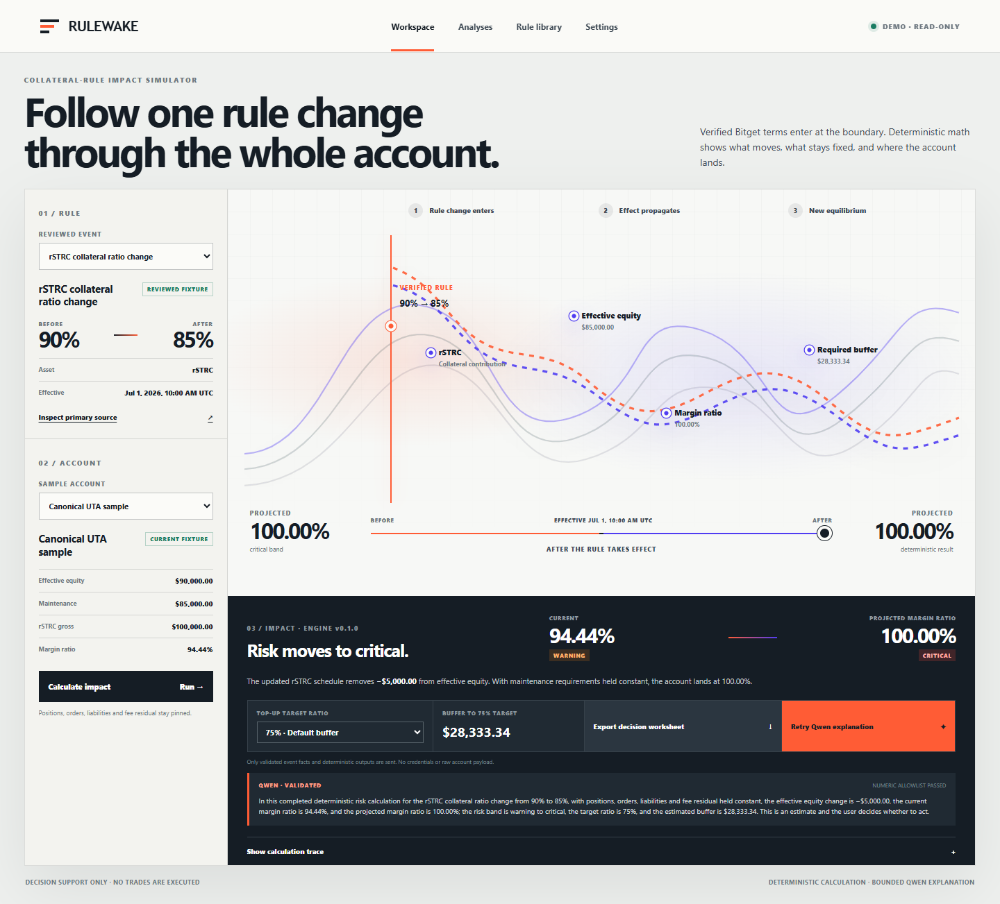

# Rulewake

**See what a Bitget collateral-rule change does to the whole account before it takes effect.**

[Live demo](https://rulewake.vercel.app/) · [Public code](https://github.com/ShalyX/Rulewake) · [Demo video](https://github.com/ShalyX/Rulewake/releases/download/rulewake-cinematic-demo/rulewake_cinematic_demo.mp4) · [Submission pack](./outputs/uta-risk-desk/submission/README.md) · [Architecture](./outputs/uta-risk-desk/submission/ARCHITECTURE.md)



Rulewake is a read-only research desk for Bitget Unified Trading Account collateral changes. It turns a reviewed rule update into a deterministic before-and-after account projection, then lets Qwen explain the validated result. The trader makes the final decision.

Built for **Bitget AI Base Camp Hackathon S2**, in **AI Trading Desk → Decision Stress Testing**.

## The problem

UTA collateral ratios can change without an account balance changing. When that happens, the collateral contribution moves first, effective equity moves with it, and the account can land in a different margin-risk band.

The usual workflow is fragmented: read an announcement, find the effective time, inspect account state, reproduce tiered collateral math, and decide whether the existing buffer still works. A generic chatbot can summarize the announcement, but it should not own the arithmetic.

## The complete research task

The public scenario asks:

> What happens to this UTA account when the rSTRC collateral ratio changes from 90% to 85%?

With positions, orders, liabilities and fee residual held constant, Rulewake computes:

| Result | Before | Projected |
| --- | ---: | ---: |
| Effective equity | $90,000.00 | $85,000.00 |
| Margin ratio | 94.44% | 100.00% |
| Risk band | Warning | Critical |
| Buffer to a 75% target | — | $28,333.34 |

These are fixture-backed decision-support results, not a liquidation prediction or trading instruction.

## How it works

1. Choose a reviewed Bitget collateral update.
2. Inspect the dated primary source and before/after parameters.
3. Run decimal-safe deterministic math against a pinned account snapshot.
4. Follow the rule through collateral contribution, effective equity, margin ratio and required buffer.
5. Ask Qwen to explain only the allowlisted facts and computed outputs.
6. Export a share-safe decision worksheet.

## Product surfaces

- `/` — public product story and method
- `/app` — causal scenario workspace
- `/analyses` — browser-local decision history
- `/library` — reviewed rule and source library
- `/settings` — server readiness, privacy boundary and local preferences

## Safety boundary

- Bitget credentials are server-only, read-only, and scoped to the demo environment.
- Rulewake refuses a Bitget key that is not reported as read-only.
- The public scenario works from reviewed fixtures and does not require visitor credentials.
- The server recomputes financial outputs rather than trusting numbers from the browser.
- Qwen receives validated facts and deterministic outputs, never API secrets or raw account payloads.
- Model output is schema-checked and numerically allowlisted; invalid or unavailable output falls back to a deterministic explanation.
- Rulewake never places trades.

## Evidence

- 83 deterministic-engine tests passing
- 20 application tests passing
- 10-fixture Qwen extraction evaluation: 100% supported exact accuracy and 100% rejection accuracy
- authenticated Bitget demo read-only reconciliation passed
- live production Qwen explanation returned `QWEN · VALIDATED` with the numeric allowlist passed
- desktop and 390 px responsive production flows inspected

## Run locally

Requirements: Node.js 24 and npm.

```bash
npm install
npm run build
npm run dev --workspace uta-risk-desk-app
```

Open the URL printed by Next.js.

Run the full test suites:

```bash
npm test --workspace @internal/bitget-uta-impact-engine
npm test --workspace uta-risk-desk-app
```

Optional server-only environment variables are documented in [`work/uta-risk-engine/.env.example`](./work/uta-risk-engine/.env.example). Never commit `.env.local`.

## Repository map

```text
work/uta-risk-engine/      deterministic calculations, validation and Bitget/Qwen adapters
work/uta-risk-desk-app/    Next.js product and API boundary
outputs/uta-risk-desk/     evaluation evidence and final submission pack
videos/rulewake-demo/      launch-video source project
```

## Current limitations

- The public workspace demonstrates reviewed fixture scenarios; it does not expose private account payloads in the browser.
- Saved analyses use browser-local storage and do not sync across devices.
- The in-process Qwen rate limiter is intended for the current single-instance hackathon deployment.
- Rulewake is decision support, not an exchange risk oracle or execution system.
