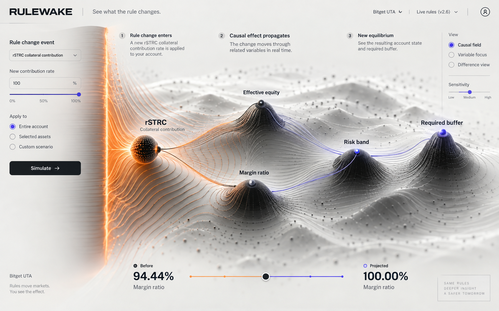
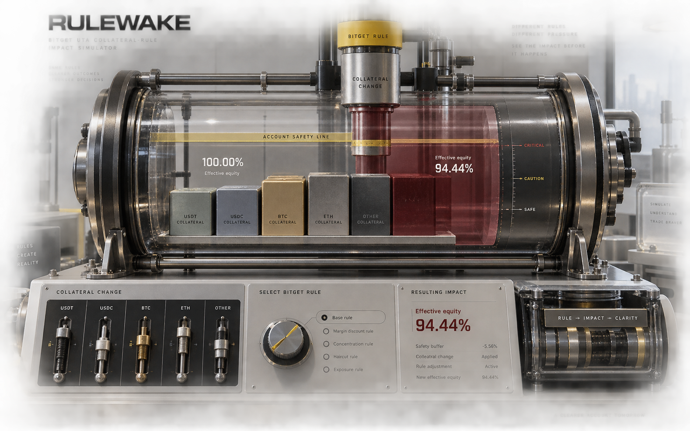
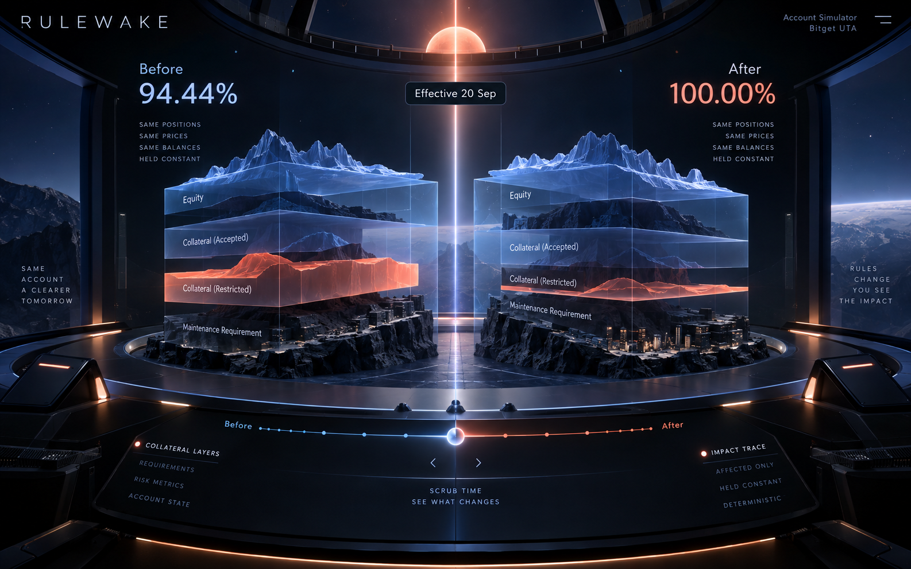

# Rulewake visual reboot territories

Updated: 19 September 2026  
Status: Causal Field selected and implemented

## Reset condition

Rulewake is the approved name. Nothing else from the first identity board is approved.

The current paper-like interface, editorial typography, warm calculation-sheet styling, conventional panels and provisional stepped-row mark are retired as design inputs. The redesign must not be a reskin of that composition.

## Interaction truth shared by every territory

The interface must make this causal chain visible:

```text
verified rule change
  → affected collateral tier
  → collateral contribution delta
  → adjusted equity delta
  → margin-ratio movement
  → risk band and required buffer
```

The redesign may be spatial, physical or cinematic, but it cannot obscure the deterministic numbers, source, assumptions, failure state or trace.

## Territory 1 — Causal Field

**Selected 19 September 2026.** The production implementation uses the calculation graph as the spatial field and includes the effective-time scrubber recommended below.



### Idea

The account is a continuous dependency field. A rule-change boundary enters the system and visibly deforms only the variables downstream of it.

### What is ownable

The central terrain is not market price. Its topology is generated from the actual calculation graph: affected collateral, effective equity, margin ratio, risk band and buffer. The “wake” is the movement of consequence through that graph.

### Interaction model

- Select an official event at the field boundary.
- Run the deterministic calculation.
- Watch the disturbance propagate through named calculation nodes.
- Isolate one node to reveal its exact before/after terms.
- Collapse the field into a share-safe trace and worksheet.

### Risk

It can become beautiful but vague. Labels, focus states and an accessible non-spatial trace must remain first-class.

## Territory 2 — Pressure Chamber



### Idea

The unified account becomes a calibrated apparatus. Collateral contributions physically support the safety line. A new rule changes one calibrated gate, and the remaining buffer compresses in view.

### What is ownable

The physical model is derived from the UTA mechanism rather than a generic dashboard metaphor: multiple collateral blocks support one shared account chamber.

### Interaction model

- Load an event into the rule gate.
- Collateral blocks resize according to progressive-tier contribution.
- The safety line and ratio gauge settle at the projected state.
- Pull the chamber apart into an exploded deterministic trace.
- Switch to reduced-motion mode for an immediate before/after state.

### Risk

It can drift into skeuomorphic spectacle or look like a game. Controls must remain precise, responsive and realistically implementable for the hackathon.

## Territory 3 — Split-Time Observatory



### Idea

Current and projected account states occupy two synchronized spatial volumes separated by the announcement's effective-time threshold. Scrubbing across the threshold moves only affected layers; held-constant variables remain pinned.

### What is ownable

The effective-time boundary is central to the actual job: understand the account before a published rule becomes active. The product becomes an observatory for state transition, not a report about one.

### Interaction model

- Current and projected states stay synchronized.
- A threshold scrubber crosses the published effective time.
- Changed collateral layers move; held-constant layers visibly lock.
- Difference mode removes unchanged layers and exposes the deterministic delta.
- The trace runs through the depth of the two state volumes.

### Risk

This is the most cinematic direction and the easiest to overbuild. A 2.5D implementation should preserve the concept without requiring a game engine.

## Self-critique

- **Causal Field** is the strongest product/UI concept because its spatial form comes directly from the calculation dependency graph. It is also the easiest to make genuinely interactive with web technology.
- **Pressure Chamber** is the most memorable visual metaphor, but it risks turning a serious decision tool into a decorative machine.
- **Split-Time Observatory** creates the strongest demo moment, but its dark cinematic environment is closer to familiar sci-fi interface territory and needs restraint to remain original.

## Recommendation

Take **Causal Field** forward, then borrow one useful behavior from Split-Time Observatory: scrubbing across the effective-time threshold. Do not combine their surface styling. The result should be a bright, spatial calculation landscape with a time-bound change event—not another editorial dashboard and not another dark neon terminal.

## Implementation boundary

These images are exploratory concept frames generated with the built-in image-generation tool. They are not pixel specifications, final typography, final copy or proof that every depicted control is implemented. The selected territory must be rebuilt as accessible HTML/CSS/SVG/WebGL with deterministic data and tested responsive states.
