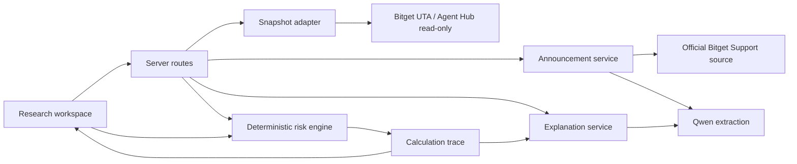

# Technical architecture

## 1. Architecture goals

- Ship one inspectable vertical slice quickly.
- Keep financial logic independent of UI and LLMs.
- Keep all secrets server-side.
- Make sample mode fully deterministic and resilient.
- Make live-demo mode optional rather than a single point of failure.
- Preserve a path to later local-first/read-only account connectivity without building it during the hackathon.

## 2. Recommended stack

- Full-stack TypeScript application.
- Next.js App Router for UI and server routes.
- React for the research workspace.
- A decimal-arithmetic library for the calculation engine.
- Runtime schemas such as Zod for every external and model-generated payload.
- Vitest for unit/property-style tests.
- Playwright for end-to-end workflow and visual checks.
- Plain design tokens and component CSS or an existing lightweight styling system; no dependency-heavy dashboard kit.
- Serverless-compatible deployment on Vercel or an equivalent host.

No database is required for P0. Curated announcements and sample fixtures live in the repository; transient scenarios remain in the browser session.

## 3. Component boundaries



The risk engine is a pure module. It accepts normalized, validated inputs and has no network or model dependency.

## 4. Package layout

```text
src/
  app/
    page.tsx
    desk/page.tsx
    worksheet/page.tsx
    api/
      snapshot/route.ts
      announcements/route.ts
      extract/route.ts
      explain/route.ts
  components/
    account/
    announcement/
    impact/
    scenario/
    worksheet/
  domain/
    risk-engine/
      collateral.ts
      margin.ts
      buffer.ts
      trace.ts
      schemas.ts
    announcement/
      schemas.ts
      validate-tiers.ts
    account/
      normalize.ts
      schemas.ts
  server/
    bitget/
      client.ts
      snapshot.ts
    qwen/
      client.ts
      extract-change.ts
      explain-impact.ts
    announcements/
      manifest.ts
      fetch-official.ts
  fixtures/
    accounts/
    announcements/
    expected/
  styles/
  test/
```

Names may adapt to framework conventions, but domain boundaries must remain.

## 5. Server routes

### `GET /api/snapshot?mode=sample|live-demo`

Returns `AccountSnapshot`.

- `sample` reads a committed fixture.
- `live-demo` calls the server-side read-only adapter.
- It never accepts API credentials in query parameters, headers, or body.

### `GET /api/announcements`

Returns the curated manifest and validation status.

### `POST /api/extract`

Input:

- curated announcement ID; or
- whitelisted official URL in a later phase.

Output:

- validated `ParameterChange`; or
- structured validation errors.

The route verifies source identity, calls Qwen, validates the result, and binds it to a source hash.

### `POST /api/explain`

Input:

- calculation trace;
- bounded audience/readability options.

Output:

- concise explanation containing no new financial values.

The server verifies that every number in the explanation is present in the trace or rejects the output.

## 6. Client calculation flow

1. Load validated snapshot.
2. Load validated parameter change.
3. Build scenario state from bounded controls.
4. Pass normalized objects to the pure engine.
5. Render result and calculation trace.
6. Optionally request a Qwen explanation using the trace.
7. Generate worksheet from the same trace, not from rendered text.

The UI never reparses formatted currency strings.

## 7. Trust boundaries

| Boundary | Trusted? | Required control |
| --- | --- | --- |
| Bitget signed account response | Authoritative but still schema-validated | Runtime schema, timestamp, source logging |
| Bitget public market response | Authoritative for source data | Schema, freshness, error handling |
| Announcement HTML/text | Untrusted content from allowed source | Sanitization, source hash, prompt-injection isolation |
| Qwen output | Untrusted candidate structure | Strict schema and semantic validation |
| User scenario controls | Untrusted input | Bounds, decimal parsing, explicit units |
| Sample fixtures | Trusted only after tests | Hash/review and golden outputs |
| Calculation engine | Trusted after tests | Pure functions, invariants, versioned trace |

## 8. State model

```text
idle
  → snapshot_loading
  → snapshot_ready
  → announcement_loading
  → announcement_extracted
  → extraction_validated
  → calculated
  → explained (optional)
  → exported
```

Every loading state can move to an explicit error state and retry without losing the last valid immutable input.

Do not represent the workflow with one ambiguous `isLoading` flag.

## 9. Resilience

- Sample mode works with Bitget and Qwen offline.
- Curated announcements ship with prevalidated extraction fixtures.
- Live-demo failure falls back only after explicit user choice.
- Explanation failure leaves the numeric result intact.
- Network requests have timeouts and bounded retries for idempotent reads only.
- No retry loops for Qwen that could create unbounded cost.
- All server responses include a request ID, but request IDs are not account identifiers.

## 10. Deployment environments

### Local

- Sample mode default.
- Optional developer Bitget read-only/demo credentials.
- Optional Qwen key.
- Fixtures and tests available without secrets.

### Preview

- Sample mode only unless a protected preview is explicitly configured.
- No public visitor credentials.

### Production demo

- Sample mode always available.
- Optional project-owned live-demo account.
- Qwen key server-side.
- Rate limits on extraction and explanation.
- Error monitoring with payload redaction.

## 11. Environment variables

```text
BITGET_API_KEY              # project-owned read-only/demo credential only
BITGET_SECRET_KEY
BITGET_PASSPHRASE
BITGET_API_BASE_URL
BITGET_QWEN_API_KEY
BITGET_QWEN_BASE_URL=https://hackathon.bitgetops.com/v1
BITGET_QWEN_MODEL=qwen3.8-max
APP_LIVE_DEMO_ENABLED=false
APP_ALLOWED_SUPPORT_HOSTS=...
```

`.env.example` contains names and descriptions only.

## 12. Future architecture, explicitly not P0

If post-hackathon demand is proven, prefer one of:

- a local desktop/CLI companion that signs Bitget requests locally;
- Bitget-supported OAuth/Agentic account authorization with read-only scope; or
- encrypted, revocable read-only credential storage with a dedicated secrets service and security review.

Do not evolve the hackathon server into credential custody by accident.
