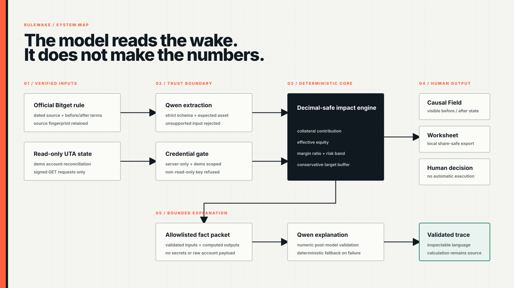
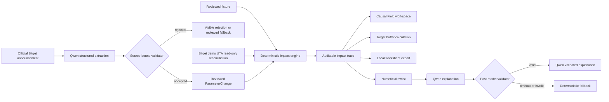

# Rulewake architecture

## System flow

## Runtime boundaries

| Boundary | Responsibility | Data allowed |
| --- | --- | --- |
| Browser | interaction, local history, visualization, worksheet export | reviewed fixture IDs, chosen target ratio, computed display result |
| Next.js server | recomputation, rate limiting, Qwen request and validation, readiness status | allowlisted scenario IDs, validated facts and deterministic outputs |
| Deterministic engine | Decimal.js financial arithmetic and trace generation | structured rule and account inputs |
| Bitget demo API | read-only UTA account information used for reconciliation | signed server-only GET requests |
| Qwen endpoint | structured extraction and bounded explanation | official source text or validated facts, never credentials or raw account payloads |

## Trust rules

1. The browser is not trusted to provide financial outputs. The server recomputes the scenario from allowlisted fixture IDs.
2. Bitget credentials are server-only. The client sends them only to `https://api.bitget.com` and refuses a key that Bitget does not report as read-only.
3. Qwen does not perform the account calculation. It receives a bounded fact set after the deterministic engine finishes.
4. Every model number must exist in the numeric allowlist. Unsupported numbers reject the answer.
5. A failed model request never removes the deterministic result.
6. The public product does not place or prepare trades.

## Failure behavior

| Failure | Behavior |
| --- | --- |
| stale account fixture | calculation disabled and stale state shown |
| incomplete or forged extraction | validator rejects fail-closed |
| source fingerprint changes | cached extraction is not silently reused |
| Qwen timeout or transport failure | deterministic explanation remains available |
| Qwen introduces an unsupported number | post-model validator rejects the answer |
| Bitget key is not read-only | client refuses account access |
| oversized or cross-origin explanation request | API rejects before provider invocation |
| repeated explanation requests | bounded in-memory rate limit and short response coalescing |

## Deployment

- Next.js 16 application deployed to Vercel Singapore region
- branded production alias: `https://rulewake.vercel.app/`
- Qwen and Bitget demo credentials stored as encrypted production environment variables
- Content Security Policy, frame denial, content-type protection and restrictive permissions policy applied to all routes

The current in-process rate limiter is appropriate for the single-instance hackathon release. A horizontally scaled release should move rate state to a trusted shared or edge store.

